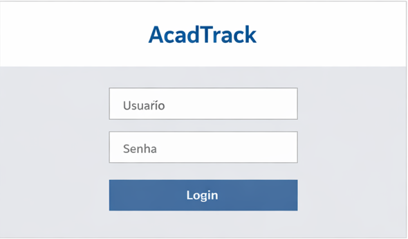
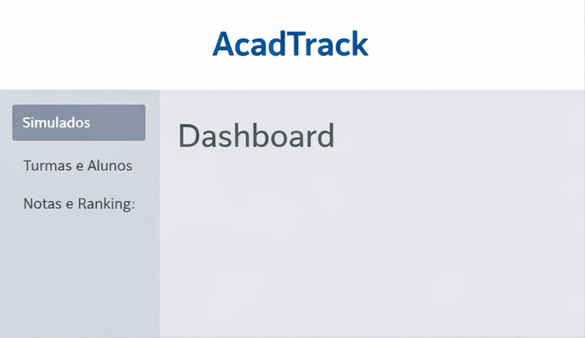
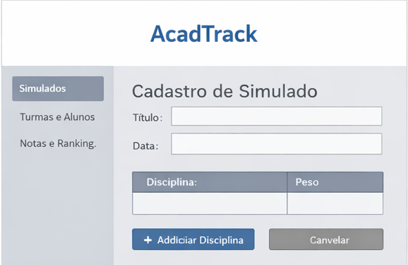
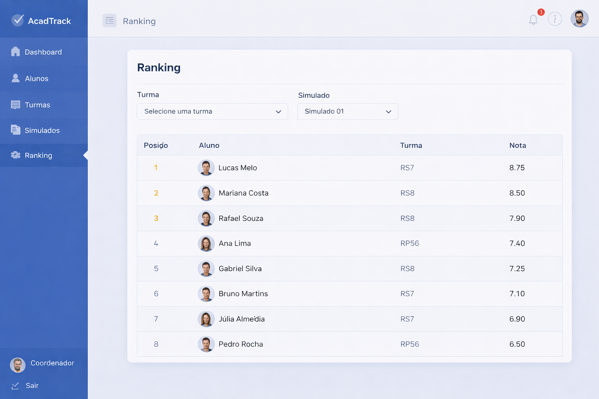

# Protótipos

Os protótipos do sistema AcadTrack estão disponíveis na pasta `prototipos/`.

## Telas

- Tela de Login
- Dashboard
- Cadastro de Simulado
- Ranking

## Descrição

## Tela de Login
Permite autenticação do usuário no sistema.

## Dashboard
Apresenta visão geral do sistema e acesso às funcionalidades.

## Cadastro de Simulado
Permite cadastrar simulados e definir disciplinas com pesos.

## Ranking
Exibe a classificação dos alunos com base no desempenho.

