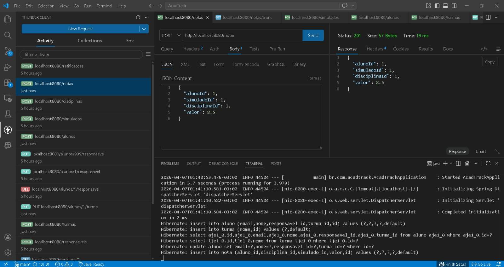
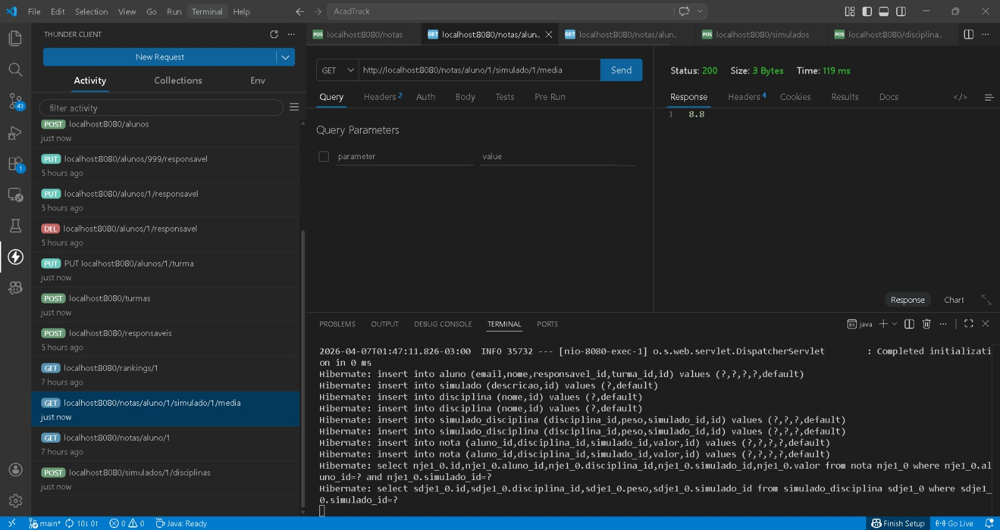
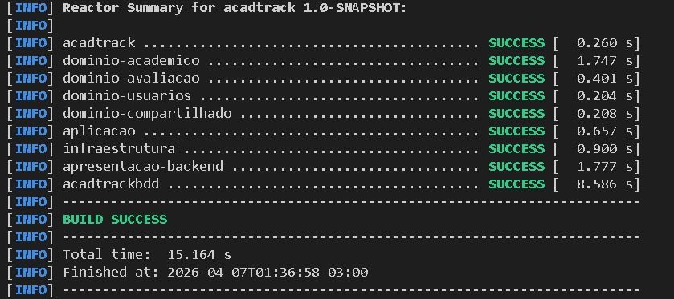

# Evidencias de Execucao

## 1. Lancamento de nota

Foi realizada a criacao de uma nota via endpoint:

POST /notas

A requisicao foi processada com sucesso (status 201), demonstrando a persistencia de dados no sistema.

---

## 2. Calculo de media ponderada

Foi executado o calculo da media de um aluno no simulado:

GET /notas/aluno/{id}/simulado/{id}/media

O sistema retornou corretamente o valor da media (8.8), comprovando a aplicacao das regras de negocio.

---

## 3. Execucao do projeto

O projeto foi executado com sucesso utilizando Maven, incluindo todos os modulos da arquitetura:

- dominio
- aplicacao
- infraestrutura
- apresentacao
- bdd

