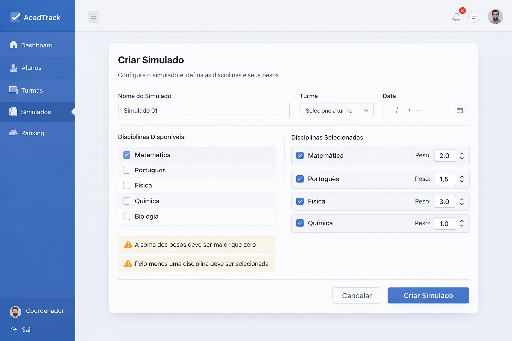
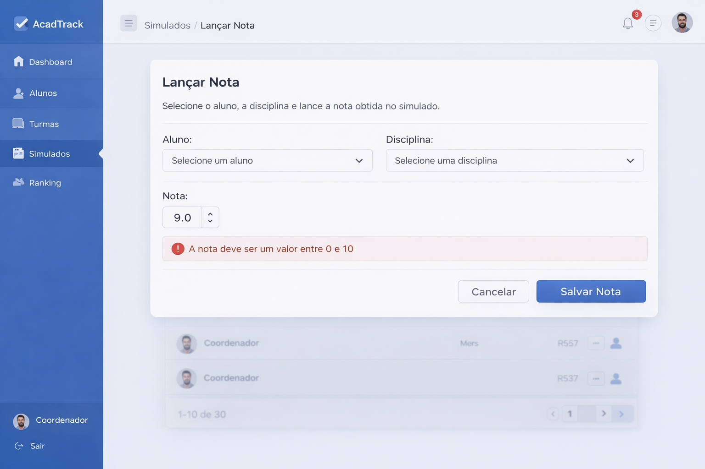
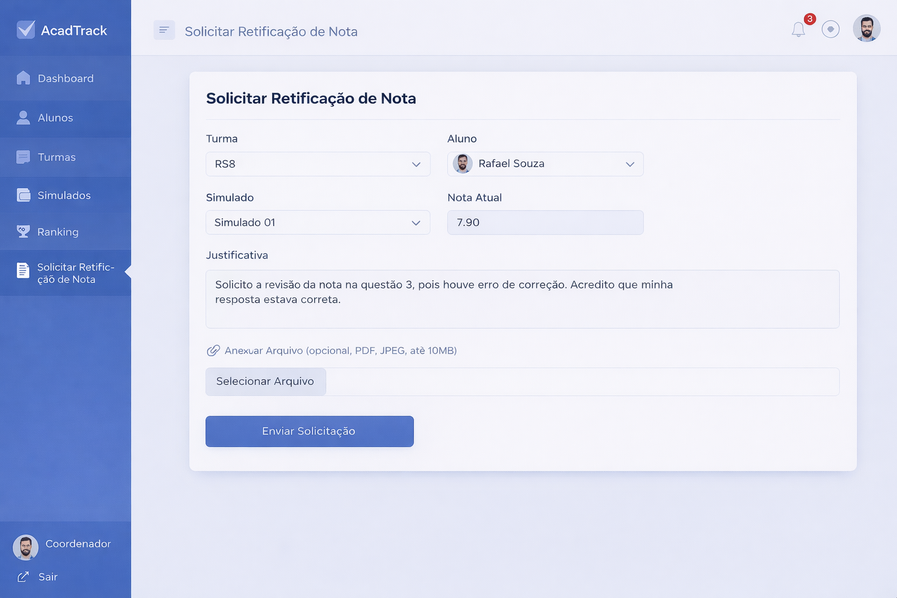
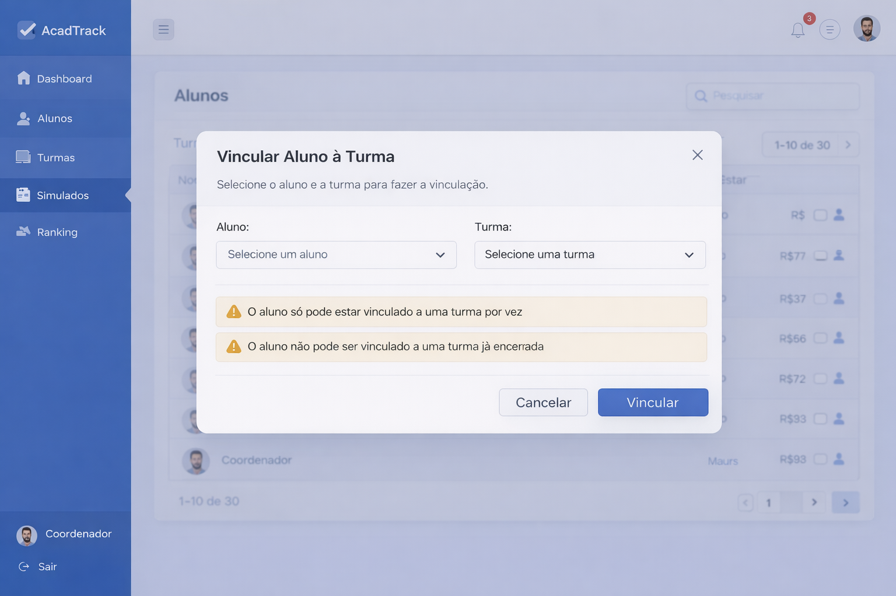

# Prototipos

Os prototipos do sistema AcadTrack estao disponiveis na pasta `prototipos/`.

## Telas

- Criacao de Simulado
- Lancamento de Notas
- Ranking
- Solicitacao de Retificacao de Nota
- Vincular aluno a turma

## Descricao

## Criacao de Simulado

## Lancamento de Notas

## Ranking

## Solicitacao de Retificacao de Nota

## Vincular aluno a turma

