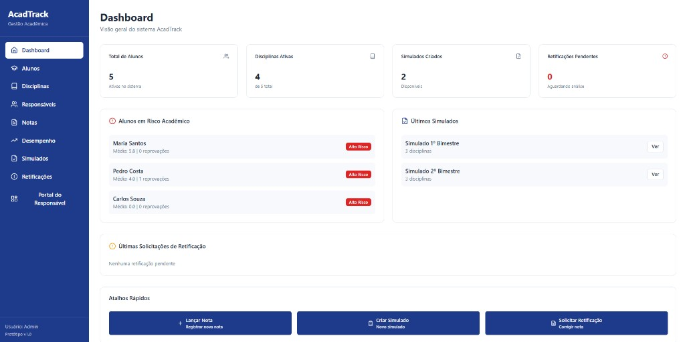
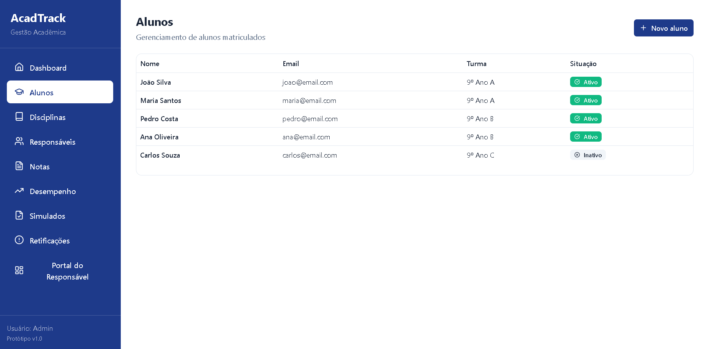
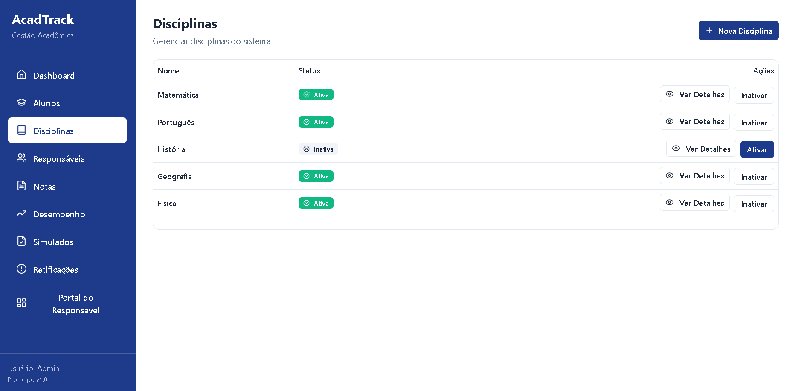
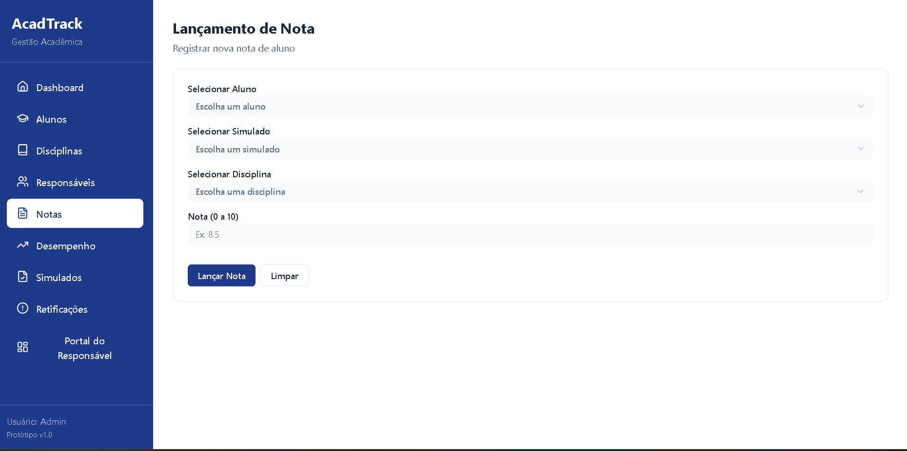
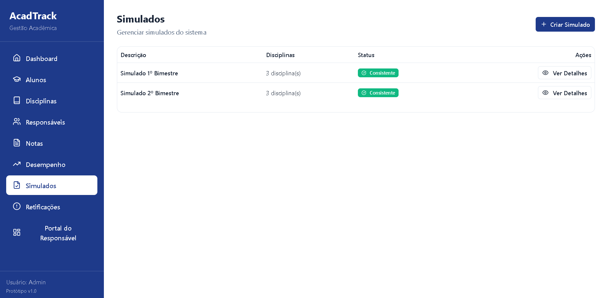
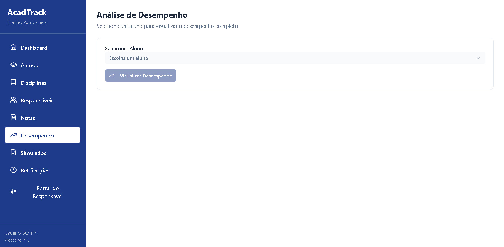
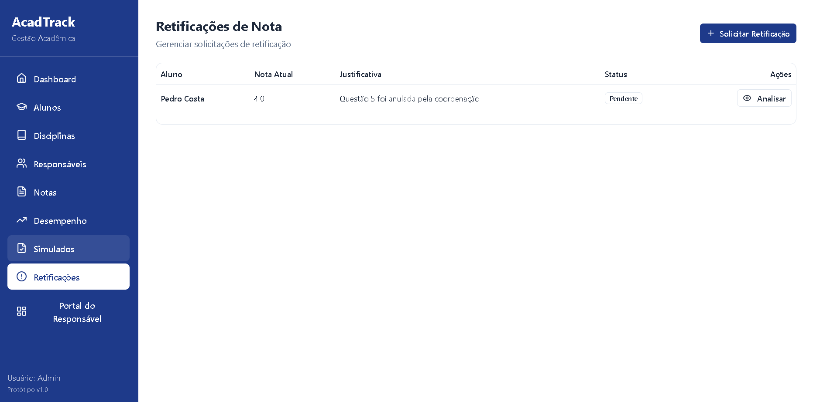
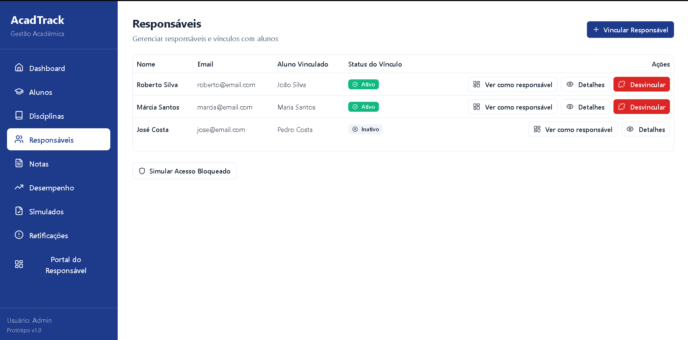
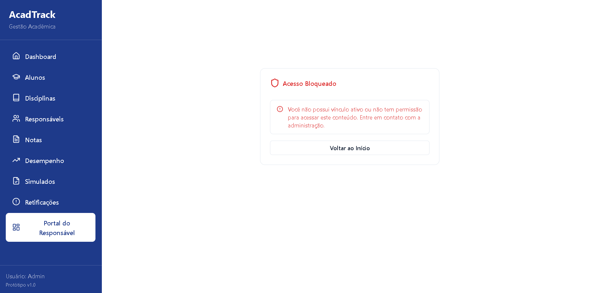

# Protótipos

Protótipo oficial da entrega: [High Fidelity Prototype (Figma)](https://stew-skip-70401626.figma.site).

O protótipo foi desenvolvido em alta fidelidade no Figma e cobre as principais telas do sistema. As capturas abaixo documentam a interface implementada, que segue fielmente o protótipo.

---

## Capturas da interface (alta fidelidade)

### Dashboard

### Alunos

### Disciplinas

### Notas

### Simulados

### Desempenho acadêmico

### Retificação de notas

### Responsáveis

### Portal do Responsável

