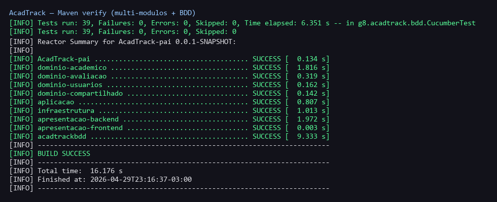
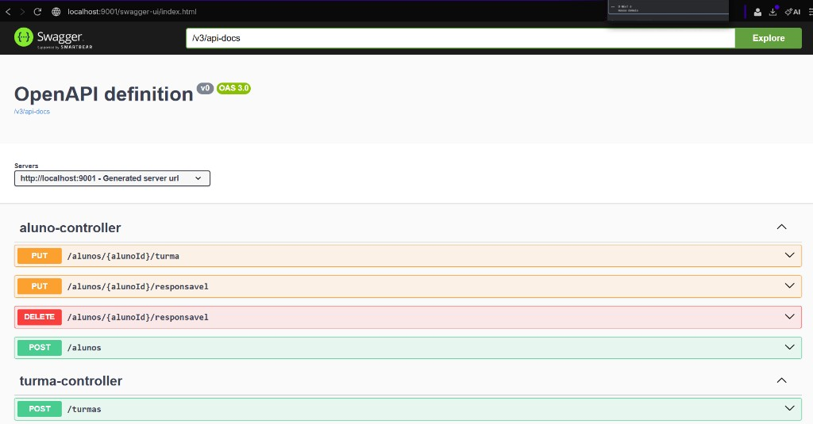
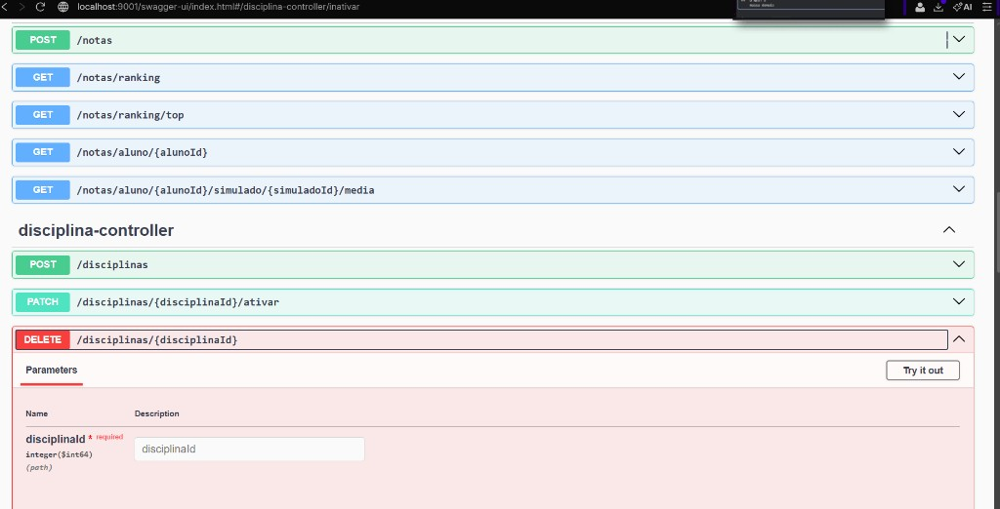
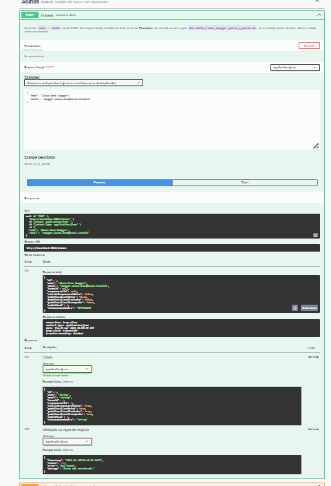
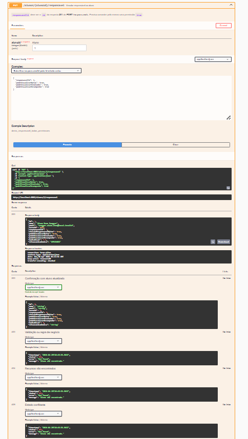
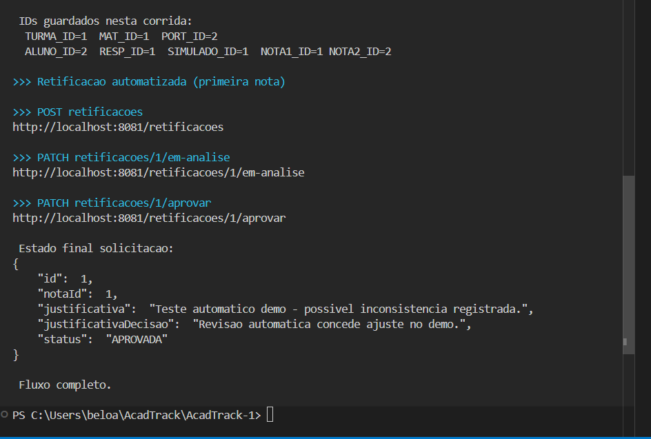

# Validações (execução e API)

Imagens na pasta [`validacoes/`](./validacoes/) (`docs/validacoes/*.png`) — registos da build, Swagger e demos em terminal.

## 1. Validação final (build e API)

Build executado com sucesso (`mvnw clean verify`), com compilação dos módulos e execução dos cenários BDD. **Captura do sumário:** 2026-04-29 (resumo Reactor + `BUILD SUCCESS` + testes Surefire/Cucumber).

Swagger da API em execução: controllers e endpoints carregados para validação dos fluxos.

Exemplo de validação de endpoint no Swagger na demonstração (disciplina-controller).

Swagger — **POST `/alunos`**: cadastro com resposta **201 Created** (`id` gerado no corpo).

Swagger — **PUT `/alunos/{alunoId}/responsavel`**: vínculo do responsável com **200 OK**.

## 2. Script `demo-fluxo-api.ps1`

Saída no PowerShell ao executar [`scripts/demo-fluxo-api.ps1`](../scripts/demo-fluxo-api.ps1): IDs criados nesta corrida, chamadas POST/PATCH da retificação automatizada (`/retificacoes`, `em-analise`, `aprovar`), resposta JSON com **`status`: `APROVADA`**, mensagem «Fluxo completo.».

